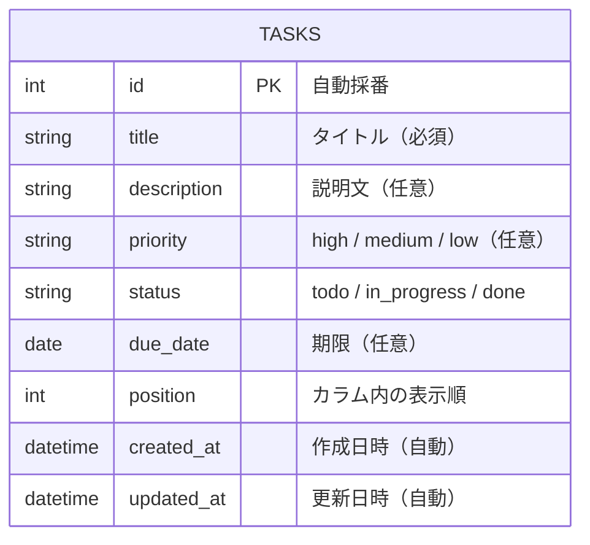

# データベース設計書

## ER図

---

## テーブル定義

### tasks テーブル

| フィールド | 型 | 必須 | 備考 |
|-----------|-----|------|------|
| id | INT (AUTO INCREMENT) | ○ | 主キー |
| title | VARCHAR(255) | ○ | タスクタイトル |
| description | TEXT | - | 説明文 |
| priority | ENUM('high','medium','low') | - | 優先度 |
| status | ENUM('todo','in_progress','done') | ○ | カラムに対応 |
| due_date | DATE | - | 期限 |
| position | INT | ○ | カラム内並び順（デフォルト0） |
| created_at | DATETIME | ○ | 自動セット |
| updated_at | DATETIME | ○ | 更新時自動セット |

---

## インデックス

| インデックス名 | 対象カラム | 種別 | 用途 |
|--------------|-----------|------|------|
| PRIMARY | id | PRIMARY KEY | レコード一意識別 |
| idx_tasks_status | status | INDEX | カラム別タスク取得の絞り込み |
| idx_tasks_status_position | status, position | INDEX | カラム内表示順ソートの高速化 |
| idx_tasks_due_date | due_date | INDEX | 期限順並び替え・期限切れ検索の高速化 |

---

## 制約

| 制約名 | 対象カラム | 種別 | 内容 |
|--------|-----------|------|------|
| pk_tasks | id | PRIMARY KEY | 主キー制約 |
| nn_tasks_title | title | NOT NULL | タイトルは必須 |
| nn_tasks_status | status | NOT NULL | ステータスは必須 |
| nn_tasks_position | position | NOT NULL | 表示順は必須 |
| chk_tasks_priority | priority | CHECK | 'high', 'medium', 'low' のいずれか、またはNULL |
| chk_tasks_status | status | CHECK | 'todo', 'in_progress', 'done' のいずれか |
| def_tasks_position | position | DEFAULT | デフォルト値 0 |
| def_tasks_created_at | created_at | DEFAULT | INSERT時に現在日時を自動セット |
| nn_tasks_created_at | created_at | NOT NULL | 作成日時は必須 |
| nn_tasks_updated_at | updated_at | NOT NULL | 更新日時は必須 |
