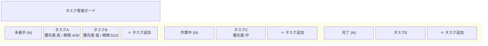
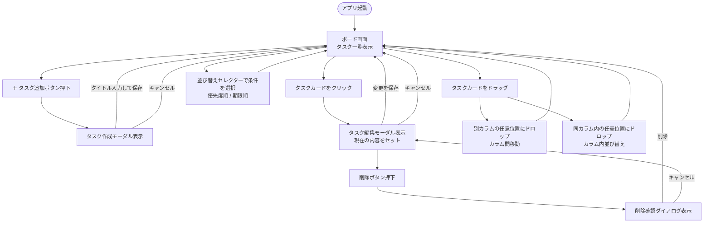

# 画面設計書

## 画面一覧

| 画面名 | 概要 |
|--------|------|
| ボード画面 | メイン画面。カラムとタスクカードを表示する |
| タスク作成/編集モーダル | タスクの作成・編集時に表示するダイアログ |
| 削除確認ダイアログ | タスク削除時の確認ダイアログ |

---

## ワイヤーフレーム

### ボード画面

```
┌─────────────────────────────────────────────────────────────┐
│  タスク管理ボード                                             │
├───────────────────┬───────────────────┬─────────────────────┤
│      未着手        │      作業中        │       完了           │
│      (3)          │      (1)          │       (2)            │
├───────────────────┼───────────────────┼─────────────────────┤
│ ┌───────────────┐ │ ┌───────────────┐ │ ┌─────────────────┐ │
│ │ タスクA       │ │ │ タスクC       │ │ │ タスクE         │ │
│ │ 優先度: 高    │ │ │ 優先度: 中    │ │ │                 │ │
│ │ 期限: 4/30   │ │ │               │ │ │                 │ │
│ └───────────────┘ │ └───────────────┘ │ └─────────────────┘ │
│ ┌───────────────┐ │                   │ ┌─────────────────┐ │
│ │ タスクB       │ │                   │ │ タスクF         │ │
│ │ 優先度: 低    │ │                   │ │                 │ │
│ │ 期限: 5/10   │ │                   │ └─────────────────┘ │
│ └───────────────┘ │                   │                     │
│                   │                   │                     │
│  [＋ タスク追加]  │  [＋ タスク追加]  │  [＋ タスク追加]    │
└───────────────────┴───────────────────┴─────────────────────┘
```

### タスク作成/編集モーダル

```
┌───────────────────────────────┐
│  タスクを追加 / 編集           │
├───────────────────────────────┤
│ タイトル *                     │
│ ┌─────────────────────────┐   │
│ │                         │   │
│ └─────────────────────────┘   │
│                               │
│ 説明文                         │
│ ┌─────────────────────────┐   │
│ │                         │   │
│ └─────────────────────────┘   │
│                               │
│ 優先度          期限           │
│ [高▼]          [yyyy-mm-dd]   │
│                               │
├───────────────────────────────┤
│  [削除]       [キャンセル][保存]│
└───────────────────────────────┘
```

### 削除確認ダイアログ

```
┌───────────────────────────────┐
│  タスクを削除しますか？         │
│                               │
│  この操作は元に戻せません。     │
│                               │
│         [キャンセル]  [削除]   │
└───────────────────────────────┘
```

### Mermaid によるワイヤーフレーム（ブロック構造）



---

## 画面遷移図



---

## 画面要件

### ボード画面

| 要件 | 内容 |
|------|------|
| レイアウト | 3カラム横並び（固定）、各カラム幅は均等 |
| カラムヘッダー | カラム名とタスク枚数バッジを表示（W3） |
| タスクカード | タイトル・優先度・期限を表示。期限切れは赤ハイライト（W1） |
| ドラッグ&ドロップ | カード全体がドラッグ可能。カラム間移動・カラム内の任意位置への並び替えが可能。ドロップ先を挿入ラインとカラムハイライトで視覚的に表示（M5） |
| 並び替え | カラムごとに優先度順・期限順を一括ソートできるセレクター。ソート後もD&Dで自由に順序を変更可能（W2） |
| タスク追加ボタン | 各カラム最下部に配置 |

### タスク作成/編集モーダル

| 要件 | 内容 |
|------|------|
| 開き方 | 作成：「＋ タスク追加」ボタン押下 / 編集：カードクリック |
| タイトル | 必須入力。未入力時は保存ボタンを非活性またはエラー表示 |
| 説明文 | 任意入力。複数行テキストエリア |
| 優先度 | 高・中・低のセレクトボックス（任意） |
| 期限 | 日付ピッカー（任意） |
| 削除ボタン | 編集時のみ表示。押下で削除確認ダイアログへ遷移 |
| キャンセル | モーダルを閉じてボード画面に戻る |
| 保存 | APIを通じてDB保存後、モーダルを閉じてボード画面を更新 |

### 削除確認ダイアログ

| 要件 | 内容 |
|------|------|
| 表示タイミング | タスク編集モーダルの削除ボタン押下時 |
| 削除 | APIを通じてDBから削除し、ボード画面からカードを除去 |
| キャンセル | ダイアログを閉じ、編集モーダルに戻る |
