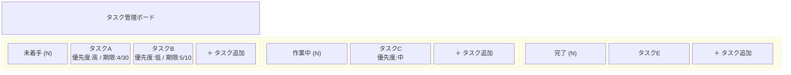
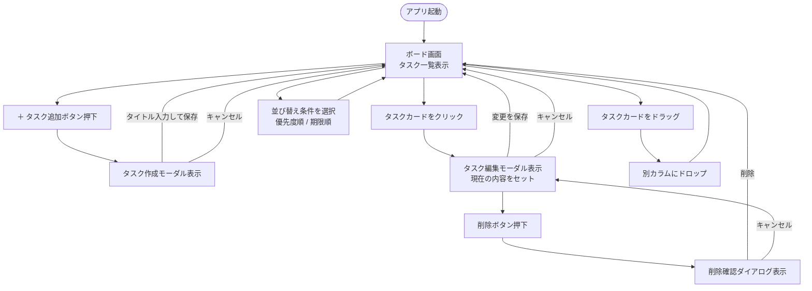
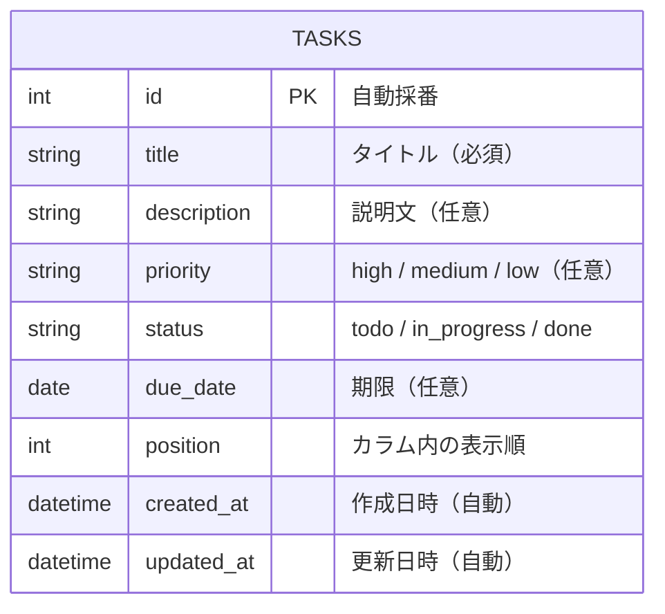

# タスク管理アプリ 要件定義書

## プロジェクト背景・目的

### 背景

プログラミングスクールの課題として、フロントエンドからバックエンド・DBまでを含むフルスタックアプリケーションを開発する。
単なる動作確認にとどまらず、実務を意識した設計・実装スキルを習得することを目的とする。

### 現状の課題（学習上の課題）

| 課題 | 内容 |
|------|------|
| フロントエンドのみの経験 | ReactなどUIの実装は触れているが、APIサーバー・DBとの連携経験がない |
| データ永続化の理解不足 | localStorageでの一時保存は知っているが、実際のDB設計・運用を経験していない |
| フルスタック構成の未経験 | フロント・バック・DBを連携させたアプリを一から構築した経験がない |

### 目的・ゴール

- フロントエンド（React）＋バックエンド（Java / Spring Boot）＋DB（PostgreSQL）の構成を自分で構築できるようになる
- REST APIの設計・実装を理解する
- DBのテーブル設計（ER図）を実際のコードに落とし込む経験を積む

### 期待される効果

- フルスタック構成の全体像を把握できる
- APIの叩き方・レスポンスの扱い方を実践的に理解できる
- 今後の実務・就職活動において「作ったものの説明」ができる

---

## プロジェクト概要

| 項目 | 内容 |
|------|------|
| アプリ名 | タスク管理アプリ（Trello風） |
| 利用者 | 個人（シングルユーザー、認証なし） |
| 構成 | フロントエンド + バックエンド + DB |
| 開発目的 | プログラミングスクール課題・学習用 |

---

## 制約事項

| 項目 | 内容 |
|------|------|
| ユーザー認証 | 不要（シングルユーザー前提） |
| マルチユーザー対応 | スコープ外 |
| スマートフォン対応 | スコープ外（デスクトップブラウザ優先） |
| カラムのカスタマイズ | スコープ外（固定3カラム） |
| リアルタイム同期 | スコープ外 |
| 通知・リマインダー | スコープ外 |

---

## 非機能要件

### パフォーマンス

| 項目 | 基準 |
|------|------|
| APIレスポンス | 通常操作（取得・作成・更新・削除）は1秒以内 |
| カード件数 | 100件程度まで問題なく動作すること |
| 初期表示 | ページロードから表示完了まで3秒以内 |

### 対応環境

| 項目 | 内容 |
|------|------|
| 対応ブラウザ | Google Chrome 最新版（メイン）、Safari 最新版 |
| 対応デバイス | デスクトップPC（ウィンドウ幅1280px以上を基準） |
| OS | macOS / Windows |

### 信頼性・保守性

| 項目 | 内容 |
|------|------|
| データ保存 | 操作後即座にDBへ反映し、ブラウザを閉じてもデータが保持されること |
| エラー時 | APIエラー発生時はユーザーに分かりやすいメッセージを表示すること |
| コード品質 | コンポーネント・関数は単一責任を意識し、可読性を保つこと |

### セキュリティ

| 項目 | 内容 |
|------|------|
| SQLインジェクション | ORMを使用し直接クエリを避ける |
| CORS | フロントエンドのオリジンのみ許可する |
| 入力値 | バックエンド側でバリデーションを行う（詳細は基本設計フェーズで定義） |

---

## 画面構成

### 画面一覧

| 画面名 | 概要 |
|--------|------|
| ボード画面 | メイン画面。カラムとタスクカードを表示する |
| タスク作成/編集モーダル | タスクの作成・編集時に表示するダイアログ |
| 削除確認ダイアログ | タスク削除時の確認ダイアログ |

### ワイヤーフレーム

#### ボード画面

```
┌─────────────────────────────────────────────────────────────┐
│  タスク管理ボード                                             │
├───────────────────┬───────────────────┬─────────────────────┤
│      未着手        │      作業中        │       完了           │
│      (3)          │      (1)          │       (2)            │
├───────────────────┼───────────────────┼─────────────────────┤
│ ┌───────────────┐ │ ┌───────────────┐ │ ┌─────────────────┐ │
│ │ タスクA       │ │ │ タスクC       │ │ │ タスクE         │ │
│ │ 優先度: 高    │ │ │ 優先度: 中    │ │ │                 │ │
│ │ 期限: 4/30   │ │ │               │ │ │                 │ │
│ └───────────────┘ │ └───────────────┘ │ └─────────────────┘ │
│ ┌───────────────┐ │                   │ ┌─────────────────┐ │
│ │ タスクB       │ │                   │ │ タスクF         │ │
│ │ 優先度: 低    │ │                   │ │                 │ │
│ │ 期限: 5/10   │ │                   │ └─────────────────┘ │
│ └───────────────┘ │                   │                     │
│                   │                   │                     │
│  [＋ タスク追加]  │  [＋ タスク追加]  │  [＋ タスク追加]    │
└───────────────────┴───────────────────┴─────────────────────┘
```

#### タスク作成/編集モーダル

```
┌───────────────────────────────┐
│  タスクを追加 / 編集           │
├───────────────────────────────┤
│ タイトル *                     │
│ ┌─────────────────────────┐   │
│ │                         │   │
│ └─────────────────────────┘   │
│                               │
│ 説明文                         │
│ ┌─────────────────────────┐   │
│ │                         │   │
│ └─────────────────────────┘   │
│                               │
│ 優先度          期限           │
│ [高▼]          [yyyy-mm-dd]   │
│                               │
├───────────────────────────────┤
│  [削除]       [キャンセル][保存]│
└───────────────────────────────┘
```

#### 削除確認ダイアログ

```
┌───────────────────────────────┐
│  タスクを削除しますか？         │
│                               │
│  この操作は元に戻せません。     │
│                               │
│         [キャンセル]  [削除]   │
└───────────────────────────────┘
```

Mermaid によるワイヤーフレーム（ブロック構造）:



---

## 画面遷移図



---

## ユースケース・操作フロー

### UC-01 タスクを作成する

**トリガー：** ユーザーが「＋ タスク追加」ボタンを押す

```
1. ボード画面の「未着手」カラムにある「＋ タスク追加」ボタンを押す
2. タスク作成モーダルが表示される
3. タイトル（必須）、説明文、優先度、期限を入力する
4. 「保存」ボタンを押す
5. タスクがAPIを通じてDBに保存され、「未着手」カラムにタスクカードが追加される
```

**例外：** タイトルが未入力の場合、保存できずエラーメッセージを表示する

---

### UC-02 タスクを編集する

**トリガー：** ユーザーがタスクカードをクリックする

```
1. ボード画面上のタスクカードをクリックする
2. タスク編集モーダルが表示され、現在の内容が入力欄に反映される
3. 必要な項目を変更する
4. 「保存」ボタンを押す
5. 変更内容がAPIを通じてDBに保存され、ボード画面に反映される
```

**例外：** タイトルを空にした状態では保存できずエラーメッセージを表示する

---

### UC-03 タスクを削除する

**トリガー：** ユーザーがタスク編集モーダル内の「削除」ボタンを押す

```
1. タスク編集モーダル内の「削除」ボタンを押す
2. 削除確認ダイアログが表示される
3. 「削除」ボタンを押す
4. タスクがAPIを通じてDBから削除され、ボード画面からタスクカードが消える
```

**例外：** 「キャンセル」を押した場合、削除されず編集モーダルに戻る

---

### UC-04 タスクを別のカラムに移動する

**トリガー：** ユーザーがタスクカードをドラッグする

```
1. ボード画面上のタスクカードをドラッグする
2. 移動先のカラムにドロップする
3. タスクのステータスがAPIを通じてDBに保存され、移動先のカラムにタスクカードが表示される
```

---

### UC-05 タスクを並び替える

**トリガー：** ユーザーが並び替え条件を選択する

```
1. ボード画面のカラム上部にある並び替え機能で条件（優先度順 / 期限順）を選択する
2. 選択した条件に基づいてカラム内のタスクカードが並び替えられる
```

---

## 機能一覧

### Must（必須機能）

| # | 機能 | 詳細 |
|---|------|------|
| M1 | カラム表示 | 「未着手」「作業中」「完了」の固定3カラムを横並びで表示する |
| M2 | タスク作成 | タスク作成モーダルからタイトル（必須）を入力してタスクを追加する |
| M3 | タスク編集 | タスクカードをクリックして編集モーダルを開き、各項目を変更できる |
| M4 | タスク削除 | 編集モーダル内の削除ボタンから確認ダイアログを経て削除する |
| M5 | カラム間移動 | ドラッグ&ドロップでタスクを別カラムへ移動する |
| M6 | データ永続化 | バックエンドAPI経由でDBに保存する |

### Want（あると嬉しい機能）

| # | 機能 | 詳細 |
|---|------|------|
| W1 | 期限切れ警告 | 期限を過ぎたタスクを赤くハイライトして視覚的に警告する |
| W2 | カラム内並び替え | 優先度順・期限順でカラム内のタスクを並び替えられる |
| W3 | タスク枚数バッジ | 各カラムのヘッダーにタスク枚数を表示する |
| W4 | 優先度フィルター | 優先度でタスクを絞り込んで表示できる |

---

## ER図・データ設計



### フィールド詳細

| フィールド | 型 | 必須 | 備考 |
|-----------|-----|------|------|
| id | INT (AUTO INCREMENT) | ○ | 主キー |
| title | VARCHAR(255) | ○ | タスクタイトル |
| description | TEXT | - | 説明文 |
| priority | ENUM('high','medium','low') | - | 優先度 |
| status | ENUM('todo','in_progress','done') | ○ | カラムに対応 |
| due_date | DATE | - | 期限 |
| position | INT | ○ | カラム内並び順（デフォルト0） |
| created_at | DATETIME | ○ | 自動セット |
| updated_at | DATETIME | ○ | 更新時自動セット |

---

## 技術選定

### フロントエンド

| 項目 | 技術 | 選定理由 |
|------|------|---------|
| フレームワーク | React（Vite） | コンポーネント設計の学習に最適、情報量が多い |
| スタイリング | Tailwind CSS | クラスベースで素早くUIを構築できる |
| ドラッグ&ドロップ | dnd-kit | React向けに設計されており軽量 |
| 状態管理 | useState / useReducer | 外部ライブラリ不要でシンプルに管理できる |
| HTTPクライアント | axios | REST API通信が簡潔に書ける |

### バックエンド

| 項目 | 技術 | 選定理由 |
|------|------|---------|
| 言語 | Java | 静的型付けで実務での採用率が高い |
| フレームワーク | Spring Boot | Javaのデファクトスタンダード、DI・MVC・JPA等を一括提供 |
| ORM | Spring Data JPA / Hibernate | エンティティ定義とDB操作を簡潔に記述できる |
| API形式 | REST API | GraphQLより学習コストが低く実務でも広く使われる |
| ビルドツール | Gradle | 依存管理・ビルドの標準ツール |

### データベース・インフラ

| 項目 | 技術 | 選定理由 |
|------|------|---------|
| DB | PostgreSQL | 実務で広く使われる、Spring Data JPAとの相性が良い |
| ローカル実行 | Docker（docker-compose） | 環境構築を統一できる |

### API設計（エンドポイント概要）

| メソッド | パス | 内容 |
|---------|------|------|
| GET | /api/tasks | 全タスク取得 |
| POST | /api/tasks | タスク作成 |
| PATCH | /api/tasks/:id | タスク更新（内容・ステータス・並び順） |
| DELETE | /api/tasks/:id | タスク削除 |

---

## スコープ外

- ユーザー認証・マルチユーザー対応
- カラムの追加・削除・名前変更
- ラベル・タグ機能
- 通知・リマインダー
- スマートフォン・タブレット対応
- リアルタイム同期（WebSocket等）
